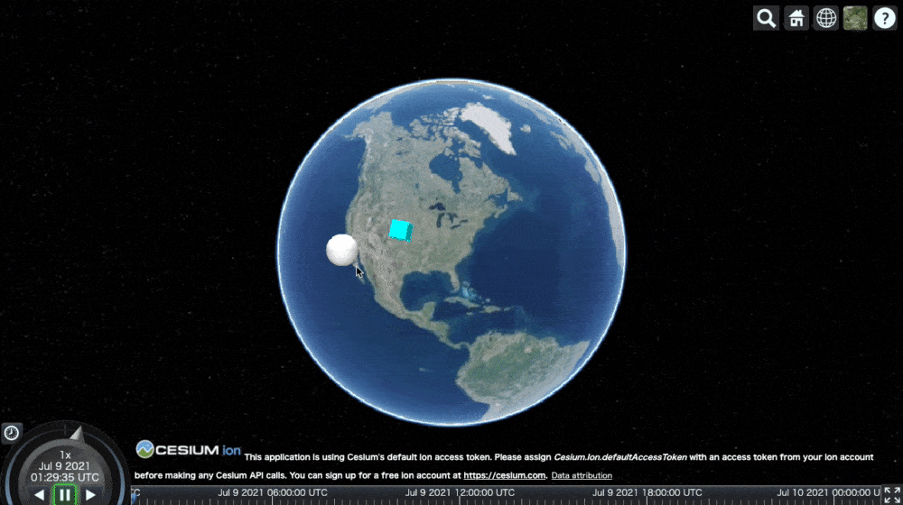

# cesium-dnd

cesium-dnd makes Cesium entities draggable with less code. [Demo](https://reearth.github.io/cesium-dnd/)



## Getting Started

To install:

```sh
npm install cesium cesium-dnd
# or
yarn add cesium cesium-dnd
```

Or

```html
<script src="https://unpkg.com/cesium-dnd@1.0.0/dist/cesiumdnd.umd.production.min.js"></script>
<script>
  const viewer = new Cesium.Viewer("cesiumContainer");
  new CesiumDnD(viewer);
</script>
```

## Usage

```js
// Init cesium-dnd
const viewer = new Cesium.Viewer("cesiumContainer");
const cesiumDnD = new CesiumDnD(viewer, {
  onDrag: (e, position) => {
    // e is Entity and position is { lat: number, lng: number, height: number }
  },
  onDragging: (e, position) => {
    // e is Entity and position is { lat: number, lng: number, height: number }
  },
  onDrop: (e, position) => {
    // e is Entity and position is { lat: number, lng: number, height: number }
  }
});

// Disable drag and drop
cesiumDnD.disable();

// Enable drag and drop
cesiumDnD.enable();
```

## License
[MIT License](./LICENSE)
